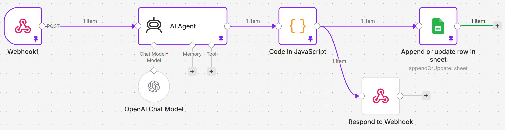

## UTOPIA — Marketing & Events AI Agent

One-line: An AI agent that turns raw meeting transcripts into a LinkedIn post, follow-up email, and press angle using the LAUNCH framework.

## How to Run

1. n8n workflow is hosted on n8n Cloud (webhook endpoint receives POST requests)
2. Submit a transcript via the form → outputs appear on screen + logged to Google Sheets

## Live Links

| Resource | Link |
|----------|------|
| Live Site | [elaborate-kashata-e71762.netlify.app](https://profound-concha-f73382.netlify.app/) |
| Loom Demo | [Watch the 5-min walkthrough](https://www.loom.com/share/068696490a534101b4ce29ad6b48ecb5) |
| Google Sheet (output log) | [View Sheet](https://docs.google.com/spreadsheets/d/1vXJrU21Q0hRQd36zH3ZbkmIHG5gM4ND49B7mxwh-RLk/edit?usp=sharing) |

## Architecture

Website (Netlify) → Webhook (n8n) → AI Agent (GPT-4o-mini) → Code Parser → Google Sheets → Response

## Prompt Used

### System Message:
You are the LAUNCH framework marketing agent for Utopia Studio. LAUNCH stands for Lead, Amplify, Unify, Nurture, Convert, Harvest.

When given a meeting transcript, immediately produce:

**LINKEDIN_POST**: A strong, opinionated LinkedIn post (150-200 words, includes CTA)  
**FOLLOW_UP_EMAIL**: Personalised to the attendee, references specific transcript moments  
**PRESS_ANGLE**: One sharp sentence a journalist could run with

### User Message:
**1. Meeting Title**: [title]  
**2. Date**: [date]  
**3. Attendee**: [name] ([email])  
**4. Transcript**: [transcript]  

## Tools & APIs

| Tool | Purpose |
|------|---------|
| n8n Cloud | Workflow orchestration |
| OpenAI GPT-4o-mini | Content generation |
| Google Sheets API | Output logging |
| Netlify | Frontend hosting |
| Claude (Anthropic) | Frontend code generation |

## Pseudocode

INPUT: title, date, attendee_name, attendee_email, transcript

1. User submits form on website

2. Frontend sends POST request to n8n webhook URL with JSON body

3. n8n receives payload:
    Extract: title, date, name, email, transcript
   
4. Send to GPT-4o-mini:  
    System prompt: LAUNCH framework rules  
    User message: formatted transcript + metadata
   
5. Receive AI response (raw text)

6. Code node parses response:  
    Split by "LINKEDIN_POST:", "FOLLOW_UP_EMAIL:", "PRESS_ANGLE:"  
    Store each section as separate variable

7. Write to Google Sheets:  
    Row: [timestamp, title, date, name, linkedin_post, email_draft, press_angle]

8. Return JSON to frontend:   
    { linkedin_post, follow_up_email, press_angle }

9. Frontend displays outputs to user

OUTPUT: Three formatted content pieces + logged to Sheets

## Workflow Diagram

## LAUNCH Framework

- **L**ead — Identify the sharpest insight
- **A**mplify — Turn it into a signal for LinkedIn/email/press
- **U**nify — Connect to Utopia's brand narrative
- **N**urture — Personalised follow-up
- **C**onvert — Drive next action
- **H**arvest — Extract press-ready angle
